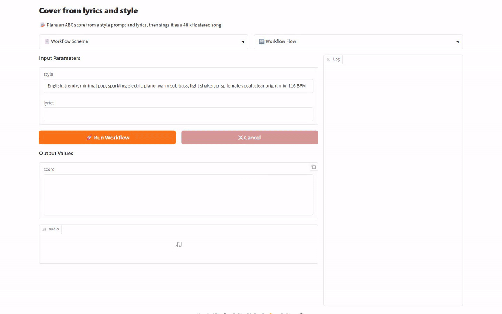

[English](README.md) · [한국어](README.ko.md) · [中文](README.zh-cn.md)

# music-generation-yue2

This service takes a style prompt and lyrics and returns a 48 kHz stereo song together with the score it was sung from.

## Model

[`m-a-p/YuE2-3B`](https://huggingface.co/m-a-p/YuE2-3B) is an open music generation model that turns lyrics and a style prompt into a full song with vocals and accompaniment.
It can write an ABC score before it produces any audio.

## Demo



## Quick Start

It needs [model-compose](https://github.com/hanyeol/model-compose) 0.4.111 or later.

Install with [uv](https://docs.astral.sh/uv/):

```bash
uv pip install model-compose
```

Or with pip:

```bash
pip install model-compose
```

Clone this repository:

```bash
git clone https://github.com/MindrLabs/music-generation-yue2
cd music-generation-yue2
```

Run it:

```bash
model-compose up
```

The gradio interface opens on `http://localhost:8081` and the HTTP API on `http://localhost:8080/api`.
`SERVER_PORT` and `PORT` change each port.

| On the first run | What happens |
| :---: | --- |
| Virtual environment | model-compose builds an environment at `.venv/composer` and installs `torch==2.10.0` and the `yue2-infer` 0.1.6 wheel |
| Checkpoints | it downloads `m-a-p/YuE2-3B` at 7.30 GB and `m-a-p/YuE2-Vae`, the decoder the component uses by default, at 0.53 GB |

`DEVICE` defaults to `cuda`.
On a MacBook, add `cpu_offload: vae` to the `composer` component and start it with `DEVICE=mps model-compose up`.
The MacBook M1 row in the performance table was measured with that setup.
With `max_concurrent_count: 1`, a second request waits until the first one finishes.

## Performance

| Machine | Runtime | Items | Cold start (s) | First output per item (s) | End to end per item (s) | Total (s) | Output RTF | Peak VRAM (GiB) | Peak RSS (GiB) | vs RTX 4090 | Accuracy | Verdict |
| :---: | --- | --- | --- | --- | --- | --- | --- | --- | --- | --- | --- | --- |
| RTX 4090 | model-compose + pytorch 2.10.0+cu128 | 20 | 10.9 | 23.7 | 23.9 | 492 | 0.361 | 9.47 | 15.5 | 1.00× | — | baseline |
| DGX Spark | model-compose + pytorch 2.10.0+cu130 | 20 | 14.4 | 96.0 | 97.1 | 2029 | 1.46 | 9.80 | 56.8 | 4.06× | — | pass |
| MacBook M1 | model-compose + pytorch 2.10.0 | 1 | 9.01 | 378 | 379 | 379 | 13.0 | — | 4.33 | 15.8× | — | pass |

Per-item figures are medians; the total runs from ready to the last item.
The ratio divides each row's end to end per item by the fastest row's.
Rows ran different numbers of items, so the total is not comparable across rows.
Rows also differ in Runtime, so the speed gap is not hardware alone.
A blank VRAM cell means the runner could not read that machine's accelerator, not that the run used none.
DGX Spark, MacBook M1 each share one memory pool between processor and accelerator, so their VRAM and RSS peaks count the same bytes twice.

> [!NOTE]
> The RTX 4090's Output RTF of 0.361 means a one-minute song takes about 22 seconds, so it is ready before it could finish playing.
> The DGX Spark's 1.46 means a one-minute song takes about 88 seconds, so the song arrives slower than it plays.
> The MacBook M1's 13.0 means a one-minute song takes about 13 minutes, and it comes from a single item.

### Measurement conditions

| Item | Value |
| :---: | --- |
| Dataset | 20 items written for this benchmark |
| Metric | a domain tool measured the distance between machines |
| Checkpoint | [m-a-p/YuE2-3B@14fc6c6f146441b1dd6363fcb2e01e82a6914cb7](https://huggingface.co/m-a-p/YuE2-3B/tree/14fc6c6f146441b1dd6363fcb2e01e82a6914cb7) |
| Accuracy | machine distance |
| Published score | no published score was compared; this checks equivalence between machines only |

## Limits

Accuracy was only checked as agreement between machines, and no published score was compared.

## License

| Covers | License | Commercial use |
| :---: | --- | :---: |
| This service | [`LICENSE`](LICENSE) | ✓ |
| `m-a-p/YuE2-3B` weights | [`MODEL_LICENSE`](https://github.com/multimodal-art-projection/YuE/blob/main/MODEL_LICENSE) | ✗ |
| Songs an individual creator makes with them | [`MODEL_LICENSE`](https://github.com/multimodal-art-projection/YuE/blob/main/MODEL_LICENSE) | ✓ |
